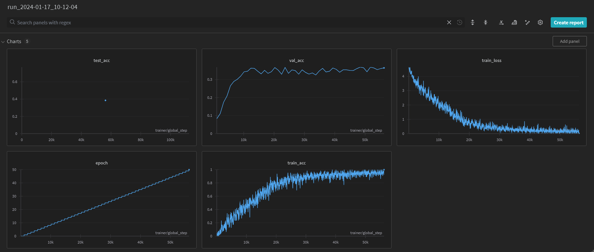
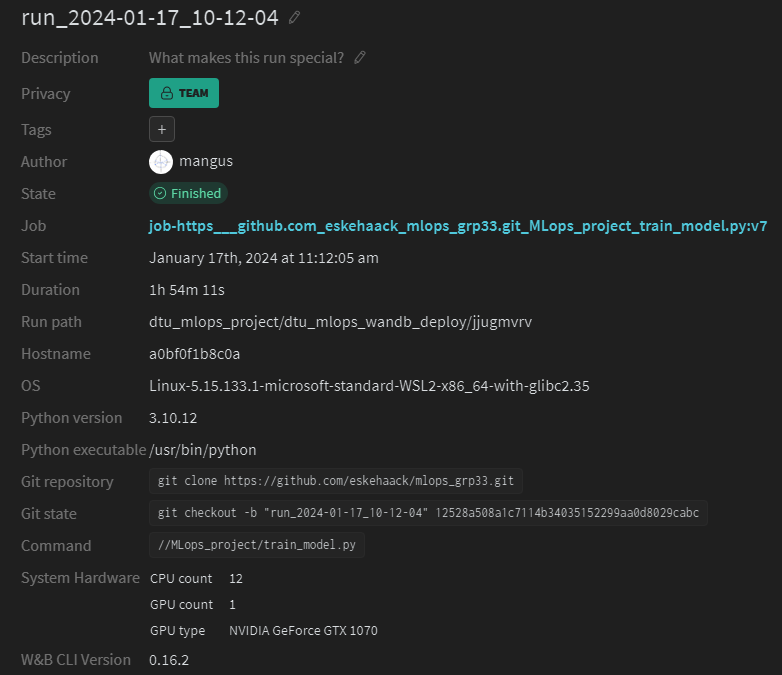
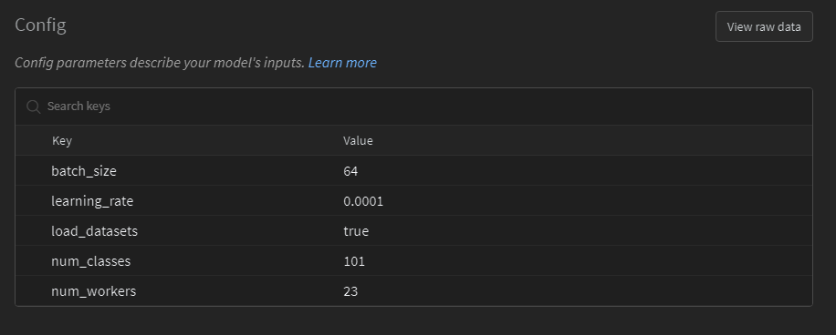
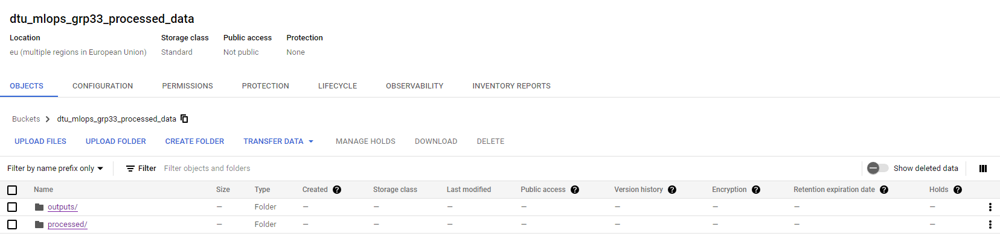
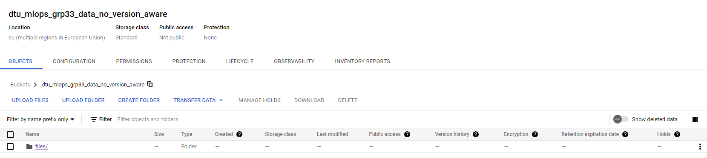
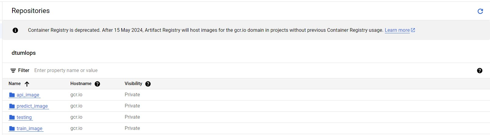
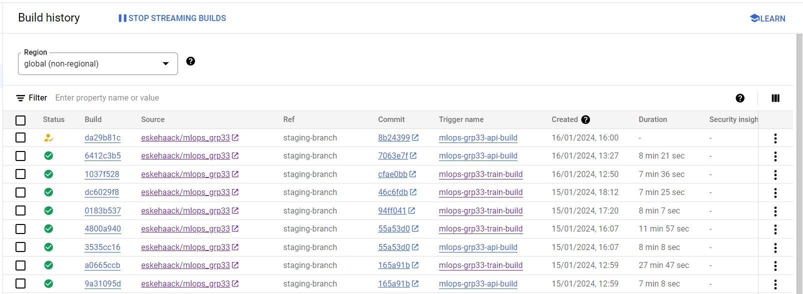

# Exam template for 02476 Machine Learning Operations

This is the report template for the exam. Please only remove the text formatted as with three dashes in front and behind
like:

```--- question 1 fill here ---```

where you instead should add your answers. Any other changes may have unwanted consequences when your report is auto
generated in the end of the course. For questions where you are asked to include images, start by adding the image to
the `figures` subfolder (please only use `.png`, `.jpg` or `.jpeg`) and then add the following code in your answer:

```markdown

```

In addition to this markdown file, we also provide the `report.py` script that provides two utility functions:

Running:

```bash
python report.py html
```

will generate an `.html` page of your report. After deadline for answering this template, we will autoscrape
everything in this `reports` folder and then use this utility to generate an `.html` page that will be your serve
as your final handin.

Running

```bash
python report.py check
```

will check your answers in this template against the constrains listed for each question e.g. is your answer too
short, too long, have you included an image when asked to.

For both functions to work it is important that you do not rename anything. The script have two dependencies that can
be installed with `pip install click markdown`.

## Overall project checklist

The checklist is *exhaustic* which means that it includes everything that you could possible do on the project in
relation the curricilum in this course. Therefore, we do not expect at all that you have checked of all boxes at the
end of the project.

### Week 1

* [X] Create a git repository
* [X] Make sure that all team members have write access to the github repository
* [X] Create a dedicated environment for you project to keep track of your packages
* [X] Create the initial file structure using cookiecutter
* [X] Fill out the `make_dataset.py` file such that it downloads whatever data you need and
* [X] Add a model file and a training script and get that running
* [X] Remember to fill out the `requirements.txt` file with whatever dependencies that you are using
* [X] Remember to comply with good coding practices (`pep8`) while doing the project
* [X] Do a bit of code typing and remember to document essential parts of your code
* [X] Setup version control for your data or part of your data
* [X] Construct one or multiple docker files for your code
* [X] Build the docker files locally and make sure they work as intended
* [X] Write one or multiple configurations files for your experiments
* [X] Used Hydra to load the configurations and manage your hyperparameters
* [X] When you have something that works somewhat, remember at some point to to some profiling and see if
      you can optimize your code
* [X] Use Weights & Biases to log training progress and other important metrics/artifacts in your code. Additionally,
      consider running a hyperparameter optimization sweep.
* [X] Use Pytorch-lightning (if applicable) to reduce the amount of boilerplate in your code

### Week 2

* [X] Write unit tests related to the data part of your code
* [X] Write unit tests related to model construction and or model training
* [X] Calculate the coverage.
* [X] Get some continuous integration running on the github repository
* [X] Create a data storage in GCP Bucket for you data and preferable link this with your data version control setup
* [X] Create a trigger workflow for automatically building your docker images
* [X] Get your model training in GCP using either the Engine or Vertex AI
* [X] Create a FastAPI application that can do inference using your model
* [ ] If applicable, consider deploying the model locally using torchserve
* [X] Deploy your model in GCP using either Functions or Run as the backend

### Week 3

* [X] Check how robust your model is towards data drifting
* [X] Setup monitoring for the system telemetry of your deployed model
* [X] Setup monitoring for the performance of your deployed model
* [ ] If applicable, play around with distributed data loading
* [ ] If applicable, play around with distributed model training
* [ ] Play around with quantization, compilation and pruning for you trained models to increase inference speed

### Additional

* [ ] Revisit your initial project description. Did the project turn out as you wanted?
* [ ] Make sure all group members have a understanding about all parts of the project
* [ ] Uploaded all your code to github

## Group information

### Question 1
> **Enter the group number you signed up on <learn.inside.dtu.dk>**
>
> Answer:

33

### Question 2
> **Enter the study number for each member in the group**
>
> Example:
>
> *sXXXXXX, sXXXXXX, sXXXXXX*
>
> Answer:

*s214588, s214593, s214643*

### Question 3
> **What framework did you choose to work with and did it help you complete the project?**
>
> Answer length: 100-200 words.
>
> Example:
> *We used the third-party framework ... in our project. We used functionality ... and functionality ... from the*
> *package to do ... and ... in our project*.
>
> Answer:

To build our machine learning model we used the third-party PyTorch framework PyTorch-Lightning(PL). Using PL allowed us to gather most of the logic related to the training itself within the model object, which ended up being a lot easier to expand on, as well as read. A major benefit of the PL lib was the device allocation functionality of the model, as this enabled us to not have to send data, models, and whatnot to the same device repeatedly, but simply let the framework handle it after a single allocation.

Further, we used the Weight&Biases(WANDB) integration of PL to easily log custom performance and training metrics, as well as allowing for logging of all hyperparameters in 1 go.

We also used the model checkpoint, to setup well-defined parameters for when to save model checkpoints we would later use for the inference model.

## Coding environment

> In the following section we are interested in learning more about you local development environment.

### Question 4

> **Explain how you managed dependencies in your project? Explain the process a new team member would have to go**
> **through to get an exact copy of your environment.**
>
> Answer length: 100-200 words
>
> Example:
> *We used ... for managing our dependencies. The list of dependencies was auto-generated using ... . To get a*
> *complete copy of our development environment, one would have to run the following commands*
>
> Answer:

In managing dependencies for our project, we opted for a Conda setup complemented by "requirements.txt" and "requirements_dev.txt" files. When a new team member joins, replicating the environment is a straightforward process. By executing the "make environment" command in the Makefile, the Conda environment is created seamlessly. Afterward, the "make requirements" command installs necessary project dependencies, aligning the development and production setups. This systematic approach ensures consistency across team members and environments.\
The use of Conda provides an efficient means of packaging, distributing, and replicating the software environment. The Makefile acts as a convenient orchestrator for these tasks, enhancing accessibility for newcomers. The separation of requirements into distinct files caters to both project execution and development needs. In essence, our strategy revolves around simplicity and clarity, allowing new contributors to effortlessly set up an environment that mirrors the established standards, fostering a smooth onboarding experience.

### Question 5

> **We expect that you initialized your project using the cookiecutter template. Explain the overall structure of your**
> **code. Did you fill out every folder or only a subset?**
>
> Answer length: 100-200 words
>
> Example:
> *From the cookiecutter template we have filled out the ... , ... and ... folder. We have removed the ... folder*
> *because we did not use any ... in our project. We have added an ... folder that contains ... for running our*
> *experiments.*
> Answer:

For this project, we used the standard cookiecutter format and file structure. We initialized this structure from the start but removed folders that we did not deem necessary, such as the notebooks folder since we do not use any notebooks. We used the data folder to contain data. The main project folder contains the train and prediction scripts while also containing scripts that process the data, we have not used the visualization subfolder and are therefore removed. The dockerfiles folder contains the needed docker files to create images and containers, we have both dockerfiles for local setup and a cloud setup. We also added a folder for personal data, such as wandb API keys. The tests folder contains the unit tests that we use. The model performance folder contains tools such as profiling, and a script to perform data drift analysis. Lastly, since we use Hydra as our configuration tool, we also have an output folder that contains all outputs from training and prediction scripts, such as checkpoints for models, logs and wandb files.


### Question 6

> **Did you implement any rules for code quality and format? Additionally, explain with your own words why these**
> **concepts matters in larger projects.**
>
> Answer length: 50-100 words.
>
> Answer:

We enforced code quality and format standards in our project using "ruff" within a .pre-commit setup. This ensures automatic checks and fixes. In larger projects, adhering to coding standards is crucial for readability, collaboration, and maintainability. Consistent formatting streamlines comprehension and reduces errors, facilitating teamwork. Moreover, standardized code improves maintainability over time, enabling smoother integration of new features and minimizing debugging efforts. The implementation of such rules enhances overall project robustness and fosters a cohesive and efficient development environment.

## Version control

> In the following section we are interested in how version control was used in your project during development to
> corporate and increase the quality of your code.

### Question 7

> **How many tests did you implement and what are they testing in your code?**
>
> Answer length: 50-100 words.
>
> Example:
> *In total we have implemented X tests. Primarily we are testing ... and ... as these the most critical parts of our*
> *application but also ... .*
>
> Answer:

Tests in our project evaluate model and data processing. For model validation, individual data points are inferred, ensuring correct output dimensions. Scripts (training, validation, testing) undergo checks with random data, verifying loss type and non-negativity. Data loader validation involves running the loader and confirming proper batch creation and output dimensions. This comprehensive testing strategy ensures model accuracy, script functionality, and data loader integrity, contributing to a robust and reliable system.


### Question 8

> **What is the total code coverage (in percentage) of your code? If you code had an code coverage of 100% (or close**
> **to), would you still trust it to be error free? Explain you reasoning.**
>
> Answer length: 100-200 words.
>
> Example:
> *The total code coverage of code is X%, which includes all our source code. We are far from 100% coverage of our **
> *code and even if we were then...*
>
> Answer:

Our code currently achieves a 65% code coverage, as verified by the "make coverage" command from the Makefile. While 100% coverage is ideal, achieving it might not guarantee error-free code. The limitation stems from large functions encompassing extensive functionality, including loading the entire dataset, making testing time-consuming. However, breaking down these functions into smaller units and linking them could enhance coverage without compromising efficiency. While high coverage instills confidence, it's crucial to balance it with practicality, recognizing that thorough testing and code design contribute collectively to reliability. Striking this balance allows us to prioritize testing essential components without compromising project efficiency.

### Question 9

> **Did you workflow include using branches and pull requests? If yes, explain how. If not, explain how branches and**
> **pull request can help improve version control.**
>
> Answer length: 100-200 words.
>
> Example:
> *We made use of both branches and PRs in our project. In our group, each member had a branch that they worked on in*
> *addition to the main branch. To merge code we ...*
>
> Answer:

While our project primarily operated on the Google Cloud console, limiting extensive use of Git features, we incorporated some branch and pull request practices. Feature branches were employed for significant changes, with the main development residing in the "staging-branch." Pull requests facilitated the merge of feature branches into the development branch, maintaining version control. Though formal reviews were optional for non-main branch changes, we adhered to pull request structures, ensuring systematic integration. Branches and pull requests, even in a simplified workflow, contribute to organized collaboration, version control, and code review processes, fostering a more robust development environment. To better utilize the full functionality of Git, we should’ve used several more feature branches for specific fixes.

### Question 10

> **Did you use DVC for managing data in your project? If yes, then how did it improve your project to have version**
> **control of your data. If no, explain a case where it would be beneficial to have version control of your data.**
>
> Answer length: 100-200 words.
>
> Example:
> *We did make use of DVC in the following way: ... . In the end it helped us in ... for controlling ... part of our*
> *pipeline*
>
> Answer:

While DVC is setup up for the processed data of our project, we ended up not utilizing it fully due to transfer limits when using object versioning of our 101k images. While we attempted to modify our dataset to better fit with DVC we instead suffered performance gains during training. Instead we mainly continued using deterministic generation of a processed dataset from our original raw data. DVC would have shined for this project if we had gone in depth with different transformations and other processing steps, as it would have allowed us to track the development in model performance concurrently with changes in processed data used for training. Likewise, object versioning would shine if we had heavier data processing such that the checkout and pull of an old data version, would be faster than rerunning an old processing setup, to reproduce earlier results.

### Question 11

> **Discuss you continues integration setup. What kind of CI are you running (unittesting, linting, etc.)? Do you test**
> **multiple operating systems, python version etc. Do you make use of caching? Feel free to insert a link to one of**
> **your github actions workflow.**
>
> Answer length: 200-300 words.
>
> Example:
> *We have organized our CI into 3 separate files: one for doing ..., one for running ... testing and one for running*
> *... . In particular for our ..., we used ... .An example of a triggered workflow can be seen here: <weblink>*
>
> Answer:

For continuous integration, we primarily used unit testing performed by GitHub actions. For this, we define a test structure that runs on push and pull requests onto the main branch of the project repository. We structure our git so that we have a staging branch, in which features are added and when hitting a larger checkpoint within the project, we then merge this staging branch into the main branch. We want the tests to run when we do this since we want to ensure that the main branch is executable and working. We test on both ubuntu and Windows system on a single python version 3.11.7 and pytorch version 2.1.2. When a push or pull request is done, it then runs our 3 unit tests on each of the systems. We perform these tests with caching, where we cache the dependencies required to run the tests and the pip system. We do this to increase the speed of future tests since they no longer need to reinstall dependencies. Also another reason is that we have limited usage of Github actions as free users, so caching reduces the amount of required usage. We keep the caching limited to only the pip and the dependencies since we want to avoid using too much storage.

## Running code and tracking experiments

> In the following section we are interested in learning more about the experimental setup for running your code and
> especially the reproducibility of your experiments.

### Question 12

> **How did you configure experiments? Did you make use of config files? Explain with coding examples of how you would**
> **run a experiment.**
>
> Answer length: 50-100 words.
>
> Example:
> *We used a simple argparser, that worked in the following way: python my_script.py --lr 1e-3 --batch_size 25*
>
> Answer:

To run our experiments with the configuration we made use of Hydra, to track both hyperparameters and wandb entity info. Ideally, we would also add every other argument given in the main train_model.py script to make the entire training easily configurable. While it be a nice addition to add a argparser to allow for terminal configuration of a training before running, we simply found it unnecessary since we mostly setup an experiment with predetermined variables and put it into a docker image defaulting the python call anyways. For debugging we simply used nano/vim within the containers.

### Question 13

> **Reproducibility of experiments are important. Related to the last question, how did you secure that no information**
> **is lost when running experiments and that your experiments are reproducible?**
>
> Answer length: 100-200 words.
>
> Example:
> *We made use of config files. Whenever an experiment is run the following happens: ... . To reproduce an experiment*
> *one would have to do ...*
>
> Answer:

First, we created a setup that allowed Hydra to store all output in folders named by the time of running. This setup was modified to also work with VertexAI so it was stored directly into our Google bucket for use by the inference model. Further, we set up wandb such that it stores all hydra hyperparameters with the runs as well as logs the git states of the repo matching the model deployments. As such the experiments can be replicated by simply checking out the git states of the time.
A shortcoming of the current setup is that we create and run docker containers using “make” commands, which are not automatically reflected in the logging of the used command for running. Ideally, this should automatically be added as part of the wandb logging for even simpler replication.

### Question 14

> **Upload 1 to 3 screenshots that show the experiments that you have done in W&B (or another experiment tracking**
> **service of your choice). This may include loss graphs, logged images, hyperparameter sweeps etc. You can take**
> **inspiration from [this figure](figures/wandb.png). Explain what metrics you are tracking and why they are**
> **important.**
>
> Answer length: 200-300 words + 1 to 3 screenshots.
>
> Example:
> *As seen in the first image when have tracked ... and ... which both inform us about ... in our experiments.*
> *As seen in the second image we are also tracking ... and ...*
>
> Answer:

For the simple wandb logging setup we are doing for this project we simply track [key metrics](figures/wandb_img1.png) for the training. We opted not to log the validation loss as we decided the validation accuracy was a more describing metric for model performance. While our model works with images we deliberately decided not to log any images, as sampling images with their current predictions did not give any objective insight in the development of the model.\

We specifically use the validation and test as we consider our baseline performance a 1/101% because of the 101 labels. As such accuracy serves as an easy to compare metric for model performance. It could potentially also be worth measuring the validation loss, as this would give an insight into the continued convergence of the model that might not be reflected in the accuracy.

As seen in [the run overview](figures/wandb_img2.png) and mentioned in the previous question we also logged the git states of model deployment to easily checkout the state of the code used in the training, as well as relevant system information related to the run, if reproduction was necessary. Unfortunately, as previously mentioned we cannot currently track the docker commands used for the build.



Lastly as also mentioned previously we also log all defined [hyperparameters](figures/wandb_img3.png) to wandb’s dashboard to allow for comparison between models with different hyperparameters:



### Question 15

> **Docker is an important tool for creating containerized applications. Explain how you used docker in your**
> **experiments? Include how you would run your docker images and include a link to one of your docker files.**
>
> Answer length: 100-200 words.
>
> Example:
> *For our project we developed several images: one for training, inference and deployment. For example to run the*
> *training docker image: `docker run trainer:latest lr=1e-3 batch_size=64`. Link to docker file: <weblink>*
>
> Answer:

To ensure maximum reproducibility we created docker images for several specific use cases. As such there were individual images for training, torch-optimized training, as well as for the inference API to serve the prediction model. For each of these images, we had 2 sets of dockerfiles, as we developed different configurations depending if we ran the models locally, and thus copied the processed data into the containers, or for cloud where the data would be taken from the mounted Google buckets. Likewise, we made better users of build caching when run locally.

For most of the Docker setups we made elaborate Makefile commands, allowing for building and running in single concise commands. As an example, to build the docker images for training, bash command associated with local torch-optimized training consisted of:
 ```docker build -f dockerfiles_local/train_model_torch.dockerfile . -t trainer:torch_local```.
```docker run --gpus all --shm-size=4g --env-file=personal/secrets.env trainer:torch_local```.
The associated dockerfile can be found at:
https://github.com/eskehaack/mlops_grp33/blob/12528a508a1c7114b34035152299aa0d8029cabc/dockerfiles_local/train_model_torch.dockerfile

### Question 16

> **When running into bugs while trying to run your experiments, how did you perform debugging? Additionally, did you**
> **try to profile your code or do you think it is already perfect?**
>
> Answer length: 100-200 words.
>
> Example:
> *Debugging method was dependent on group member. Some just used ... and others used ... . We did a single profiling*
> *run of our main code at some point that showed ...*
>
> Answer:

While developing machine learning, bugs in the code are almost imminent. To resolve bugs, we’ve utilized VS code's built-in debugger. While pdb is a nice tool and gives you a lot of freedom when debugging, the built-in debugger in VS code is much more convenient, and doesn’t require any type of setup to get started. \
For profiling, we’ve utilized the PyTorch profiler for both CPU and CUDA performance.  For a run on the CPU, we see that what takes the most time by a large margin is the copy operation, followed by the convolution layers and the backpropagation of these layers. This profile makes sense since there are a lot of images that need to be loaded and copied. Based on this profiling, we did not do much optimization, since more time was spent on getting the model onto the cloud service, and the model had a reasonable training time. Since the tensorboard is too large in data size for github to handle, to get a tensorboard, run ‘make profiling’. A screenshot of the board is given


## Working in the cloud

> In the following section we would like to know more about your experience when developing in the cloud.

### Question 17

> **List all the GCP services that you made use of in your project and shortly explain what each service does?**
>
> Answer length: 50-200 words.
>
> Example:
> *We used the following two services: Engine and Bucket. Engine is used for... and Bucket is used for...*
>
> Answer:

To complete the project we used the following GCP services:
 * Triggers -- To automatically build docker images of both the train model and api app, when needed.
 * Bucket -- To store our data, parameters and models.
 * Vertex AI -- To train our model through a docker image.
 * Cloud run -- To host our api app.

### Question 18

> **The backbone of GCP is the Compute engine. Explained how you made use of this service and what type of VMs**
> **you used?**
>
> Answer length: 100-200 words.
>
> Example:
> *We used the compute engine to run our ... . We used instances with the following hardware: ... and we started the*
> *using a custom container: ...*
>
> Answer:

Instead of using Compute Engine directly we instead setup the training with VertexAI and hosting the Inference API with cloud run.
We specifically went with VertexAI as it allowed us to run our training script purely containerized instead of hosting it within a VM, as well as being able to directly access our processed data stored in Google buckets, rather than having to copy it into the containers. In the end we did not get to complete a full training in VertexAI as we were waiting for quotas for either a T4 or K80 accelerator, which we would have most likely used with a “n1-standard-4” machine.

For the inference API we build our container using a simple cpu-bound cloud-run setup, with minimal maximum instances, as we assumed low traffic as well as small image batches per requested inference.

However during the development of the project we did utilize a compute engine to prototype several solutions, often simply setting up a n1-standard-1 or n1-standard-4 with a T4 gpu. However, we experienced continuous problems in building images contained within google cloud itself, as well as accessing data in the buckets which led us to use VertexAi instead.

### Question 19

> **Insert 1-2 images of your GCP bucket, such that we can see what data you have stored in it.**
> **You can take inspiration from [this figure](figures/bucket.png).**
>
> Answer:

Due to the earlier mentioned DVC problems we ended up having to use 1 bucket for non-object versioned DVC files, and 1 bucket with processed data, as well as the output of hydra from training in VertexAI:

Processed data and outputs:


DVC:


### Question 20

> **Upload one image of your GCP container registry, such that we can see the different images that you have stored.**
> **You can take inspiration from [this figure](figures/registry.png).**
>
> Answer:

Registry image:


### Question 21

> **Upload one image of your GCP cloud build history, so we can see the history of the images that have been build in**
> **your project. You can take inspiration from [this figure](figures/build.png).**
>
> Answer:

GCP cloud build history:


### Question 22

> **Did you manage to deploy your model, either in locally or cloud? If not, describe why. If yes, describe how and**
> **preferably how you invoke your deployed service?**
>
> Answer length: 100-200 words.
>
> Example:
> *For deployment we wrapped our model into application using ... . We first tried locally serving the model, which*
> *worked. Afterwards we deployed it in the cloud, using ... . To invoke the service an user would call*
> *`curl -X POST -F "file=@file.json"<weburl>`*
>
> Answer:

We first build a standalone prediction script using .ckpt files from our training, as well as a folder destination of images for label inference. Then we wrapped the prediction model in a FastAPI application, where we both included a simple HTML UI for human interaction, as well as leaving the backend API interactable with the normal curl-callable endpoints.

Then as explained earlier we deploy the inference API using cloud-run, with our data-feeder service account such that the service during load, downloads all available model checkpoints, from the bucket, into its container allowing for selection between them. Then the user is free to either choose the model(at /models/), or images(/images() they want first, and finally invoke predict(at /predict/) to get the inferred label for each of the supplied images. The same can be done by prefixing any of the 3 methods by /ui/*, to get the HTML representations of the API instead.

### Question 23

> **Did you manage to implement monitoring of your deployed model? If yes, explain how it works. If not, explain how**
> **monitoring would help the longevity of your application.**
>
> Answer length: 100-200 words.
>
> Example:
> *We did not manage to implement monitoring. We would like to have monitoring implemented such that over time we could*
> *measure ... and ... that would inform us about this ... behaviour of our application.*
>
> Answer:

We implemented a data drift analysis, which tests new data compared to the original data the number and share of drifted columns. For new data, it would be obvious to use new data that belongs within the food101 database classes, such as Lasagna or Eggs benedict. Since we’re working with images, we use simple quantifications of the data such as average brightness, contrast and sharpness. This data drift is a very simple setup, and does not say much about any drifts, future work should look at a more in depth analysis. For the cloud monitoring we used the gcp monitoring service and set up alerts based on the usage of the API. This is a simple setup that tests the amount of entries and bytes that the API service receives. The alert system is set up so that an email is sent when crossing a certain threshold.

### Question 24

> **How many credits did you end up using during the project and what service was most expensive?**
>
> Answer length: 25-100 words.
>
> Example:
> *Group member 1 used ..., Group member 2 used ..., in total ... credits was spend during development. The service*
> *costing the most was ... due to ...*
>
> Answer:

During the development and deployment of models, the most expensive service has been keeping data in the buckets and the access to these(approx 10$).
Since we did not get to train our model on VertexAI we simply did a cost estimation of training.
Assuming a T4/K80 can do about the same acceleration as a 1070, we would only need about 2 hours for the model to converge for 0.22$(CPU)+0.4$(GPU) per hour, and it would not have cost more than 3$ per training(with overhead).
We estimate the final cost to be less than 25$, with continued API service.

## Overall discussion of project

> In the following section we would like you to think about the general structure of your project.

### Question 25

> **Include a figure that describes the overall architecture of your system and what services that you make use of.**
> **You can take inspiration from [this figure](figures/overview.png). Additionally in your own words, explain the**
> **overall steps in figure.**
>
> Answer length: 200-400 words
>
> Example:
>
> *The starting point of the diagram is our local setup, where we integrated ... and ... and ... into our code.*
> *Whenever we commit code and puch to github, it auto triggers ... and ... . From there the diagram shows ...*
>
> Answer:

 describes our overall architecture.
Starting from the developer side of the diagram there are two paths, both related to version control. This is important, as everything the developer creates, should be stored to ensure proper version control. Going across we go through the .pre-commit setup, in which we use ruff to automatically lint the committed code and make sure it lives up to the PEP-8 standards. From here the developer can choose to tag their code. If the code was pushed to the main branch (preferably using a PR) and tagged a couple of automatic events will trigger. GitHub actions will start checking whether the code still has the functionality it needs (in our case this is halting, read more in questions 8 and 11).
The other trigger is run through Cloud Build, here we build 3 different docker images: One for running the serve API app, one for training the model, and a less important prediction image. Potentially we could make a setup, in which both the serve API image is deployed and the training image is run automatically, this is not our case, as we had issues with getting GPUs for training our model in the cloud. Furthermore, the data pushed by the developer, though DVC, is stored in a Cloud Storage bucket. From here the training image can access the training data (which is also images, but the picture kind. Very strange, I know). During training, the training image regularly pushed logs to Weights and Biases, which we use to follow the progression of our training. After training is complete the saved model is pushed to a Cloud Storage bucket (along with its configs and key metrics). From here the end user will be able to view the newest model (and older versions for that matter) and upload a set of test images for inference. In short, the developer should only need to push a new tag in order to start the entire pipeline (which will properly take about two hours to complete). However, there are a few manual processes currently due to limitations on Google Cloud.

### Question 26

> **Discuss the overall struggles of the project. Where did you spend most time and what did you do to overcome these**
> **challenges?**
>
> Answer length: 200-400 words.
>
> Example:
> *The biggest challenges in the project was using ... tool to do ... . The reason for this was ...*
>
> Answer:

During this project, we’ve encountered a series of challenges, mostly regarding the new software solutions used in the course. The first challenge we encountered was regarding the Data Version Control framework. The specific issue was finding a suitable platform and format to store our data, that also allowed us to pull and push data with useable speeds.
While using Google Drive we discovered that sharing access for such a larger data space is a timely process. Instead, we tried using Google Storage Buckets, here we could easily share the data, but the pull speeds was halted significantly due to DVC not properly utilizing multi-threaded operations compared to the deprecated gsutil implementation. After spending an unfortunate amount of time on trying to fix it with different data and thus dataloading structures, the resulting DVC setup did not utilize object versioning and therefore stored the data in a format only readable by DVC. Because of this, we were required to upload a second “normal” (non-dvc) data set to a different bucket for the cloud models to train with.\

The next big challenge was training the model on cloud services. As the data was located in a bucket on Google Storage we assumed that the Cloud Run service would have access to it by accessing the /gcs mount like VertexAI was capable of… this was not the case. Instead, we attempted to use the Vertex AI Service, which was easier to set up for our implementation. While we did get our script running in Vertex AI we are still waiting on someone to accept our quotas for GPU access. Because of this, we mimicked the training locally and uploaded the corresponding model to the bucket, as Hydra would have done with the training scripts.

### Question 27

> **State the individual contributions of each team member. This is required information from DTU, because we need to**
> **make sure all members contributed actively to the project**
>
> Answer length: 50-200 words.
>
> Example:
> *Student sXXXXXX was in charge of developing of setting up the initial cookie cutter project and developing of the*
> *docker containers for training our applications.*
> *Student sXXXXXX was in charge of training our models in the cloud and deploying them afterward.*
> *All members contributed to code by...*
>
> Answer:

Magnus (s214588): Developed the main runtime for the train and prediction scripts, with the corresponding Pytorch Lightning model and supporting dataloading setup, as well as the wrapper for the API wrapper for the prediction script and hydra configs. Primary DVC struggler. The main contributor to the development and debugging of the docker setup for all images, as well as fixing the cloud builds and runs. Managed the deployment of VertexAI training and Inference API cloud run.

Lachlan (s214593): Was in charge of implementing the profiling with the use of the tensorboard module. Also the charge of setting up the data drift analysis and monitoring of the cloud service. Also was in charge of setting up the wandb team and project. Also contributed to CI integration of unit tests.

Eske (s214643) was in charge of the repository setup and control, here including the CI setup for unit testing. The creator of the individual unit tests and coverage setups. Primary rubber duck for s214588. In charge of the cloud build setup, creating the Cloud Build triggers and setups, and enabling the code to be built on the cloud service.
All members contributed to the debugging of the code.
